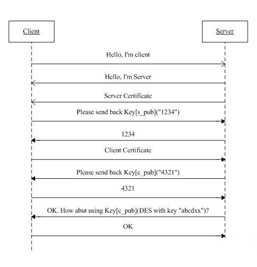
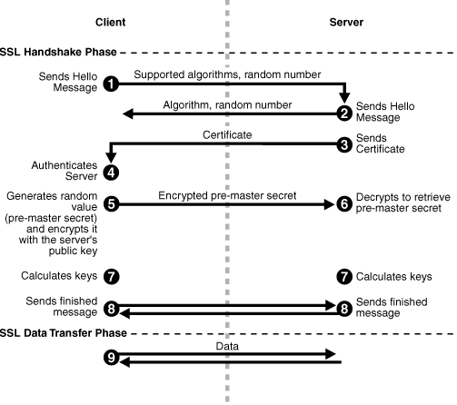

# 流程

HTTPS实际上就是HTTP+SSL的实现，建立的流程应该是这样：

①客户端的浏览器向服务器传送客户端 SSL 协议的版本号，加密算法的种类，产生的随机数，以及其他服务器和客户端之间通讯所需要的各种信息。

②服务器向客户端传送 SSL 协议的版本号，加密算法的种类，随机数以及其他相关信息，同时服务器还将向客户端传送自己的证书。

③客户利用服务器传过来的信息 验证服务器的合法性，服务器的合法性包括：证书是否过期，发行服务器证书的 CA 是否可靠，发行者证书的公钥能否正确解开服务器证书的“发行者的数字签名”，服务器证书上的域名是否和服务器的实际域名相匹配。如果合法性验证没有通过，通讯将断开；如果合法性验证通过，将继续进行第四步。

④用户端随机产生一个用于后面通讯的“对称密码”，然后 用服务器的公钥（服务器的公钥从步骤②中的服务器的证书中获得）对其加密，然后将加密后的“预主密码”传给服务器。

⑤如果服务器要求客户的身份认证（在握手过程中为可选），用户可以建立一个随机数然后对其进行数据签名，将这个含有签名的随机数和客户自己的证书以及加密过的“预主密码”一起传给服务器。

⑥如果服务器要求客户的身份认证，服务器必须检验客户证书和签名随机数的合法性，具体的合法性验证过程包括：客户的证书使用日期是否有效，为客户提供证书的CA 是否可靠，发行CA 的公钥能否正确解开客户证书的发行 CA 的数字签名，检查客户的证书是否在证书废止列表（CRL）中。检验如果没有通过，通讯立刻中断；

⑦如果验证通过，服务器将用自己的私钥解开加密的“预主密码”，然后执行一系列步骤来产生主通讯密码（客户端也将通过同样的方法产生相同的主通讯密码）。

⑧服务器和客户端用相同的主密码即“通话密码”，一个对称密钥用于 SSL 协议的安全数据通讯的加解密通讯。同时在 SSL 通讯过程中还要完成数据通讯的完整性，防止数据通讯中的任何变化。

⑨客户端向服务器端发出信息，指明后面的数据通讯将使用的步骤⑦中的主密码为对称密钥，同时通知服务器客户端的握手过程结束。

⑩服务器向客户端发出信息，指明后面的数据通讯将使用的步骤⑦中的主密码为对称密钥，同时通知客户端服务器端的握手过程结束。

SSL 的握手部分结束，SSL 安全通道的数据通讯开始，客户和服务器开始使用相同的对称密钥进行数据通讯，同时进行通讯完整性的检验。

从上面的流程可以看出（加粗字体），SSL通信在握手阶段使用的是非对称加密，在数据的传输阶段使用的是对成加密。

Client发起一个HTTPS（https:/demo.linianhui.dev）的请求，根据RFC2818的规定，Client知道需要连接Server的443（默认）端口。
Server把事先配置好的公钥证书（public key certificate）返回给客户端。
Client验证公钥证书：比如是否在有效期内，证书的用途是不是匹配Client请求的站点，是不是在CRL吊销列表里面，它的上一级证书是否有效，这是一个递归的过程，直到验证到根证书（操作系统内置的Root证书或者Client内置的Root证书）。如果验证通过则继续，不通过则显示警告信息。
Client使用伪随机数生成器生成加密所使用的会话密钥，然后用证书的公钥加密这个会话密钥，发给Server。
Server使用自己的私钥（private key）解密这个消息，得到会话密钥。至此，Client和Server双方都持有了相同的会话密钥。
Server使用会话密钥加密“明文内容A”，发送给Client。
Client使用会话密钥解密响应的密文，得到“明文内容A”。
Client再次发起HTTPS的请求，使用会话密钥加密请求的“明文内容B”，然后Server使用会话密钥解密密文，得到“明文内容B”。

# https优化

1. 硬件优化
2. 软件优化
3. 协议优化
4. 证书优化

# HTTP 和 HTTPS 的区别

HTTP 是一种 超文本传输协议(Hypertext Transfer Protocol)，HTTP 是一个在计算机世界里专门在两点之间传输文字、图片、音频、视频等超文本数据的约定和规范

HTTP 主要内容分为三部分，超文本（Hypertext）、传输（Transfer）、协议（Protocol）。

而 HTTPS 的全称是 Hypertext Transfer Protocol Secure，从名称我们可以看出 HTTPS 要比 HTTPS 多了 secure 安全性这个概念，实际上， HTTPS 并不是一个新的应用层协议，它其实就是 HTTP + TLS/SSL 协议组合而成，而安全性的保证正是 TLS/SSL 所做的工作。
也就是说，HTTPS 就是身披了一层 SSL 的 HTTP。

HTTP 和 HTTPS 的主要区别是什么呢？
- HTTP 在地址栏上的协议是以 http:// 开头，而 HTTPS 在地址栏上的协议是以 https:// 开头
- HTTP 是未经安全加密的协议，它的传输过程容易被攻击者监听、数据容易被窃取、发送方和接收方容易被伪造；而 HTTPS 是安全的协议，它通过 密钥交换算法 - 签名算法 - 对称加密算法 - 摘要算法 能够解决上面这些问题。
- HTTP 的默认端口是 80，而 HTTPS 的默认端口是 443。

# HTTP Get 和 Post 区别？

- get 请求的 URL 有长度限制，而 post 请求会把参数和值放在消息体中，对数据长度没有要求。

- get 请求会被浏览器主动 cache，而 post 不会，除非手动设置。

- get 请求在浏览器反复的 回退/前进 操作是无害的，而 post 操作会再次提交表单请求。

- get 请求在发送过程中会产生一个 TCP 数据包；post 在发送过程中会产生两个 TCP 数据包。
对于 get 方式的请求，浏览器会把 http header 和 data 一并发送出去，服务器响应 200（返回数据）；
而对于 post，浏览器先发送 header，服务器响应 100 continue，浏览器再发送 data，服务器响应 200 ok（返回数据）。

# 什么是无状态协议，HTTP 是无状态协议吗，怎么解决？

cookies机制    
JWT机制    

# 简述 HTTP1.0/1.1/2.0 的区别

## HTTP 1.0     
是在 1996 年引入的，从那时开始，它的普及率就达到了惊人的效果。

HTTP 1.0 仅仅提供了最基本的认证，这时候用户名和密码还未经加密，因此很容易收到窥探。
HTTP 1.0 被设计用来使用短链接，即每次发送数据都会经过 TCP 的三次握手和四次挥手，效率比较低。
HTTP 1.0 只使用 header 中的 If-Modified-Since 和 Expires 作为缓存失效的标准。
HTTP 1.0 不支持断点续传，也就是说，每次都会传送全部的页面和数据。
HTTP 1.0 认为每台计算机只能绑定一个 IP，所以请求消息中的 URL 并没有传递主机名（hostname）

## HTTP 1.1    

HTTP 1.1 是 HTTP 1.0 开发三年后出现的，也就是 1999 年，它做出了以下方面的变化

HTTP 1.1 使用了摘要算法来进行身份验证
HTTP 1.1 默认使用长连接，长连接就是只需一次建立就可以传输多次数据，传输完成后，只需要一次切断连接即可。长连接的连接时长可以通过请求头中的 keep-alive 来设置
HTTP 1.1 中新增加了 E-tag，If-Unmodified-Since, If-Match, If-None-Match 等缓存控制标头来控制缓存失效。
HTTP 1.1 支持断点续传，通过使用请求头中的 Range 来实现。
HTTP 1.1 使用了虚拟网络，在一台物理服务器上可以存在多个虚拟主机（Multi-homed Web Servers），并且它们共享一个IP地址。

## HTTP 2.0     

是 2015 年开发出来的标准，它主要做的改变如下

- 头部压缩，由于 HTTP 1.1 经常会出现 User-Agent、Cookie、Accept、Server、Range 等字段可能会占用几百甚至几千字节，而 Body 却经常只有几十字节，所以导致头部偏重。HTTP 2.0 使用 HPACK 算法进行压缩。
- 二进制格式，HTTP 2.0 使用了更加靠近 TCP/IP 的二进制格式，而抛弃了 ASCII 码，提升了解析效率
- 强化安全，由于安全已经成为重中之重，所以 HTTP2.0 一般都跑在 HTTPS 上。
- 多路复用，即每一个请求都是是用作连接共享。一个请求对应一个id，这样一个连接上可以有多个请求。

## 了解HTTP 3？

运行在 QUIC 之上的 HTTP 协议被称为 HTTP/3(HTTP-over-QUIC)
QUIC 协议(Quick UDP Internet Connection)基于 UDP，正是看中了 UDP 的速度与效率。同时 QUIC 也整合了 TCP、TLS 和 HTTP/2 的优 点，并加以优化。

特点:    
减少了握手的延迟(1-RTT 或 0-RTT)    
多路复用，并且没有 TCP 的阻塞问题    
连接迁移，(主要是在客户端)当由 Wifi 转移到 4G 时，连接不 会被断开。

HTTP 3与HTTP 1.1和HTTP 2没有直接的关系，也不是http2的扩展    
HTTP 3将会是一个全新的WEB协议    
HTTP 3目前处于制订和测试阶段    

# 请你说一下 HTTP 常见的请求头

通用标头、实体标头、请求标头、响应标头

## 通用标头        
通用标头主要有三个，分别是 Date、Cache-Control 和 Connection

- Date    
Date 是一个通用标头，它可以出现在请求标头和响应标头中，它的基本表示如下
Date: Wed, 21 Oct 2015 07:28:00 GMT 

- Connection
Connection 决定当前事务（一次三次握手和四次挥手）完成后，是否会关闭网络连接。Connection 有两种，一种是持久性连接，即一次事务完成后不关闭网络连接

## 实体标头    

实体标头是描述消息正文内容的 HTTP 标头。实体标头用于 HTTP 请求和响应中。头部Content-Length、 Content-Language、 Content-Encoding 是实体头。

- Content-Length 实体报头指示实体主体的大小，以字节为单位，发送到接收方。

- Content-Language 实体报头描述了客户端或者服务端能够接受的语言。

- Content-Encoding 这又是一个比较麻烦的属性，这个实体报头用来压缩媒体类型。Content-Encoding 指示对实体应用了何种编码。
常见的内容编码有这几种： gzip、compress、deflate、identity ，这个属性可以应用在请求报文和响应报文中

## 请求标头    

Host
Referer
If-Modified-Since
If-None-Match
Accept
Accept-Language

## 响应标头  

Access-Control-Allow-Origin
Keep-Alive
Server
Set-Cookie

# 地址栏输入 URL 发生了什么？

1。DNS解析
2。建立 TCP 连接
3。发起 HTTP-GET 请求
4。服务器返回

# Status Code

## 1xx Informational

100 Continue

101 Switching Protocols

102 Processing (WebDAV)

## 2xx Success

 200 OK

 201 Created

 202 Accepted

 203 Non-Authoritative Information

 204 No Content

 205 Reset Content

 206 Partial Content

 207 Multi-Status (WebDAV)

 208 Already Reported (WebDAV)

 226 IM Used

# 3xx Redirection

300 Multiple Choices

301 Moved Permanently

302 Found

303 See Other

304 Not Modified

305 Use Proxy

306 (Unused)

307 Temporary Redirect

308 Permanent Redirect (experimental)

## 4xx Client Error

 400 Bad Request

 401 Unauthorized

 402 Payment Required

 403 Forbidden

 404 Not Found

 405 Method Not Allowed

406 Not Acceptable

407 Proxy Authentication Required

408 Request Timeout

 409 Conflict

410 Gone

411 Length Required

412 Precondition Failed

413 Request Entity Too Large

414 Request-URI Too Long

415 Unsupported Media Type

416 Requested Range Not Satisfiable

417 Expectation Failed

418 I'm a teapot (RFC 2324)

420 Enhance Your Calm (Twitter)

422 Unprocessable Entity (WebDAV)

423 Locked (WebDAV)

424 Failed Dependency (WebDAV)

425 Reserved for WebDAV

426 Upgrade Required

428 Precondition Required

429 Too Many Requests

431 Request Header Fields Too Large

444 No Response (Nginx)

449 Retry With (Microsoft)

450 Blocked by Windows Parental Controls (Microsoft)

451 Unavailable For Legal Reasons

499 Client Closed Request (Nginx)

## 5xx Server Error

 500 Internal Server Error
 
501 Not Implemented

502 Bad Gateway

503 Service Unavailable

504 Gateway Timeout

505 HTTP Version Not Supported

506 Variant Also Negotiates (Experimental)

507 Insufficient Storage (WebDAV)

508 Loop Detected (WebDAV)

509 Bandwidth Limit Exceeded (Apache)

510 Not Extended

511 Network Authentication Required
