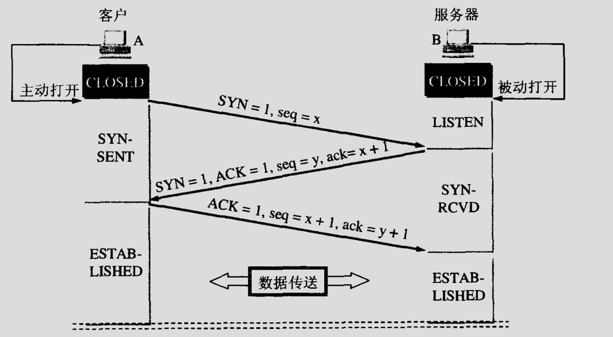
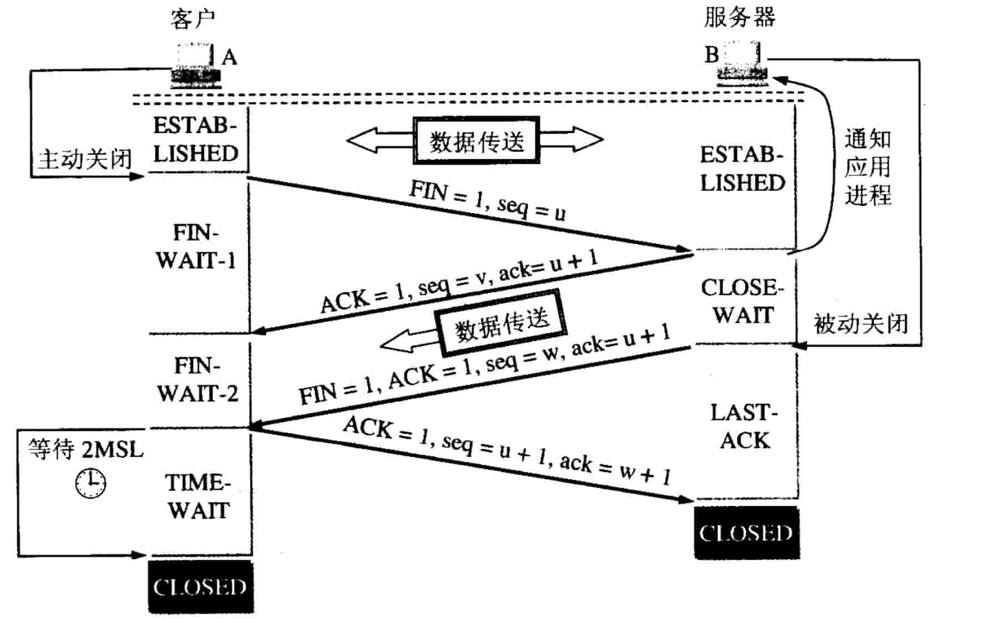

# TCP 历史及其设计哲学

TCP/IP 的前身 ARPA:NCP 协议    
• Advanced Research Projects Agency Network

1973:TCP/IP 协议    
• 文顿·格雷·瑟夫(Vinton Gray Cerf) 
• 罗伯特·艾略特·卡恩(Robert Elliot Kahn)

## TCP/IP 协议发展

1973 • TCP v1，包括 IP 功能的 TCP 协议 (RFC675)

 1977 • TCPv2
 
 1978 • TCPv3
 
 1980
• TCPv4(1981.9 RFC793)+IPv4
• 1978.8 Jon Postel:分层 TCPv3

## TCPv4 协议分层后的互联网世界

## TCP/IP 的七个设计理念    

David D Clark:《The Design Philosophy of The DARPA Internet Protocols》
1. Internet communication must continue despite loss of networks or gateways.
2. The Internet must support multiple types of communications service.
3. The Internet architecture must accommodate a variety of networks.
4. The Internet architecture must permit distributed management of its resources.
5. The Internet architecture must be cost effective.
6. The Internet architecture must permit host attachment with a low level of effort.
7. The resources used in the internet architecture must be accountable.

# TCP 解决了哪些问题?

## TCP 的作用

## TCP协议的分层   

• TCP:面向连接的、可靠的、基于字节流的传输层通信协议
• IP:根据IP地址穿越网络传送数据

## 层层嵌套的“信封”:报文头部

报文头部的层层组装与卸载        
• 不可靠的网络传输     
• 网络设备    
• 主机    
• 物理链路    

## TCP 协议特点    

• 在 IP 协议之上，解决网络通讯可依赖问题     
• 点对点(不能广播、多播)，面向连接    
• 双向传递(全双工)    
• 字节流:打包成报文段、保证有序接收、重复报文自动丢弃    
    • 缺点:不维护应用报文的边界(对比 HTTP、GRPC)    
    • 优点:不强制要求应用必须离散的创建数据块，不限制数据块大小
• 流量缓冲:解决速度不匹配问题    
• 可靠的传输服务(保证可达，丢包时通过重发进而增加时延实现可靠性) 
• 拥塞控制    


# TCP 报文格式

消息传输的核心要素

寄件人与收件人信息 
• IP地址
• TCP(UDP)端口
• HTTP Host/URI 等

物流订单号
• IP序列号
• TCP 序列号 

物流系统需求

## IP头部

## UDP 头部

 ## TCP 协议的任务    
 
• 主机内的进程寻址
• 创建、管理、终止连接
• 处理并将字节(8bit)流打包成报文段(如 IP 报文) • 传输数据
• 保持可靠性与传输质量
• 流控制与拥塞控制

## 如何标识一个连接?      
TCP 四元组(源地址，源端口，目的地址，目的端口)    
 • 对于 IPv4 地址，单主机最大 TCP 连接数为 2(32+16+32+16)    
没有连接 ID:QUIC 协议

## TCP Segment 报文段    

控制信息 
• 寻址
• 滑动窗口 
• Flags
• 校验和

数据

## 常用选项

类型 总长度(字节 数据 描述
0 - - 选项列表末尾标识 
1 - - 无意义，用于 32 位对齐使用
2 4 MSS 值 握手时发送端告知可以接收的最大报文段大小
3 3 窗口移位 指明最大窗口扩展后的大小
4 2 - 表明支持 SACK 选择性确认中间报文段功能
5 可变 确认报文段 选择性确认窗口中间的 Segments 报文段
8
10
Timestamps 时间戳
用于更精准的计算RTT，及解决 PAWS 问题
14
3
校验和算法
双方认可后，可使用新的校验和算法
15
可变
校验和
当 16 位标准校验和放不下时，放置在这里
34
可变
FOC
TFO中Cookie

# 如何使用 tcpdump 分析网络报文?

捕获及停止条件
• -D 列举所有网卡设备
• -i 选择网卡设备
• -c 抓取多少条报文
• --time-stamp-precision 指定捕获时的时间精度，默认毫秒 micro，可选纳秒 nano • -s 指定每条报文的最大字节数，默认 262144 字节


BPF:Expression 表达式
• primitives 原语:由名称或数字，以及描述它的多个限定词组成
• qualifiers 限定词
• Type:设置数字或者名称所指示类型，例如 host www.baidu.com
• Dir:设置网络出入方向，例如 dst port 80 • Proto:指定协议类型，例如 udp
• 其他
• 原语运算符
• 与:&& 或者 and
• 或:|| 或者 or
• 非:! 或者 not
• 例如:src or dst portrange 6000-8000 && tcp or ip6

限定词
Type:设置数字或者名称所指示类型
• host、port
• net ，设定子网，net 192.168.0.0 mask 255.255.255.0 等价于 net 192.168.0.0/24 • portrange，设置端口范围，例如 portrange 6000-8000

Dir:设置网络出入方向
• src、dst、src or dst、src and dst
• ra、ta、addr1、addr2、addr3、addr4(仅对 IEEE 802.11 Wireless LAN 有效)


Proto:指定协议类型
• ether、fddi、tr、 wlan、 ip、 ip6、 arp、 rarp、 decnet、 tcp、udp、icmp、igmp、icmp、 igrp、pim、ah、esp、vrrp

其他
• gateway:指明网关 IP 地址，等价于 ether host ehost and not host host
• broadcast:广播报文，例如 ether broadcast 或者 ip broadcast
• multicast:多播报文，例如 ip multicast 或者 ip6 multicast
• less, greater:小于或者大于

基于协议域过滤
• 捕获所有 TCP 中的 RST 报文 • tcp[13]&4==4
• 抓取 HTTP GET 报文
• port 80 and tcp[((tcp[12:1] & 0xf0) >> 2):4] = 0x47455420
• 注意:47455420 是 ASCII 码的 16 进制，表示”GET ”
• TCP 报头可能不只 20 字节，data offset 提示了承载数据的偏移，但它以 4 字节为单位


文件操作
• -w 输出结果至文件(可被Wireshark读取分析)
• -C 限制输入文件的大小，超出后以后缀加 1 等数字的形式递增。 注意单位是 1,000,000 字节
• -W 指定输出文件的最大数量，到达后会重新覆写第 1 个文件
• -G 指定每隔N秒就重新输出至新文件，注意-w 参数应基于
strftime 参数指定文件名
• -r 读取一个抓包文件
• -V 将待读取的多个文件名写入一个文件中，通过读取该文件同时 读取多个文件


输出时间戳格式
• -t 不显示时间戳
• -tt自1970年1月1日0点至今的秒数 • -ttt 显示邻近两行报文间经过的秒数
• -tttt 带日期的完整时间
• -ttttt 自第一个抓取的报文起经历的秒数

分析信息详情
• -e 显示数据链路层头部
• -q 不显示传输层信息
• -v 显示网络层头部更多的信息，如 TTL、id 等
• -n 显示 IP 地址、数字端口代替 hostname 等
• -S TCP 信息以绝对序列号替代相对序列号
• -A 以 ASCII 方式显示报文内容，适用 HTTP 分析
• -x 以 16 进制方式显示报文内容，不显示数据链路层
• -xx 以 16 进制方式显示报文内容，显示数据链路层
• -X 同时以 16 进制及 ACII 方式显示报文内容，不显示数据链路层 • -XX 同时以 16 进制及 ACII 方式显示报文内容，显示数据链路层


# 三次握手建立连接

## 握手的目标

同步 Sequence 序列号    
• 初始序列号 ISN(Initial Sequence Number)
交换 TCP 通讯参数    
• 如 MSS、窗口比例因子、选择性确认、指定校验和算法

## 三次握手

```
tcpdump -i lo port 80 -c 3 -S
```
 
• SYN:同步     
• ACK:确认    

1。SYN 报文
2。SYN/ACK 报文
3。ACK 报文




# 三次握手状态变迁

## 五种状态    

• CLOSED
• LISTEN
• SYN-SENT
• SYN-RECEIVED 
• ESTABLISHED

netstat 命令查看 TCP 状态    
interval: 重新显示选定的统计信息，各个显示间暂停的间隔秒数。
-a:    
-n:    
-r:    
-s:    
-o(Windows): 显示拥有的与每个连接关联的进程 ID。 -b(Windows)/-p(Linux) : 显示对应的可执行程序名字。

```
netstat -anp | grep 80
```

两端同时发送SYN:双方使用固定源端口且同时建连接
• TCB: Transmission Control Block，保存连接使用的源端口、目的端口、目的 ip、序号、 应答序号、对方窗口大小、己方窗口大小、tcp 状态、tcp 输入/输出队列、应用层输出队 列、tcp 的重传有关变量等


# 三次握手中的性能优化与安全问题    

服务器三次握手流程示例    

## 超时时间与缓冲队列  
      
应用层 connect 超时时间调整     
操作系统内核限制调整    
• 服务器端 SYN_RCV 状态    
    • net.ipv4.tcp_max_syn_backlog:SYN_RCVD 状态连接的最大个数
    • net.ipv4.tcp_synack_retries:被动建立连接时，发SYN/ACK的重试次数
• 客户端 SYN_SENT 状态    
    • net.ipv4.tcp_syn_retries = 6 主动建立连接时，发 SYN 的重试次数
    • net.ipv4.ip_local_port_range = 32768 60999 建立连接时的本地端口可用范围
• ACCEPT队列设置     

## Fast Open 降低时延

cookie

Linux上打开TCP Fast Open            
net.ipv4.tcp_fastopen:系统开启 TFO 功能    
• 0:关闭
• 1:作为客户端时可以使用 TFO
• 2:作为服务器时可以使用 TFO
• 3:无论作为客户端还是服务器，都可以使用 TFO

## 如何应对 SYN 攻击?        

攻击者短时间伪造不同 IP 地址的 SYN 报文，快速占满 backlog 队列，使 服务器不能为正常用户服务
net.core.netdev_max_backlog    
• 接收自网卡、但未被内核协议栈处理的报文队列长度
net.ipv4.tcp_max_syn_backlog    
• SYN_RCVD 状态连接的最大个数
net.ipv4.tcp_abort_on_overflow    
• 超出处理能力时，对新来的 SYN 直接回包 RST，丢弃连接

tcp_syncookies

net.ipv4.tcp_syncookies = 1        
• 当 SYN 队列满后，新的 SYN 不进入队列，计算出 cookie 再 以 SYN+ACK 中的序列号返回客户端，正常客户端发报文时， 服务器根据报文中携带的 cookie 重新恢复连接
• 由于 cookie 占用序列号空间，导致此时所有 TCP 可选 功能失效，例如扩充窗口、时间戳等

TCP_DEFER_ACCEPT    


# 数据传输与 MSS 分段

TCP 应用层编程示例     
init    
i/o    

## TCP 流的操作  
  
• read 
• write

## TCP 流与报文段    

流分段的依据    
• MSS:防止 IP 层分段     
• 流控:接收端的能力    

MSS:Max Segment Size    
定义:仅指 TCP 承载数据，不包含 TCP 头部的大小，参见 RFC879
MSS 选择目的
    • 尽量每个 Segment 报文段携带更多的数据，以减少头部空间占用比率 
    • 防止 Segment 被某个设备的 IP 层基于 MTU 拆分
默认 MSS:536 字节(默认 MTU576 字节，20 字节 IP 头部，20 字节 TCP 头部)
握手阶段协商 MSS
MSS 分类
• 发送方最大报文段 SMSS:SENDER MAXIMUM SEGMENT SIZE
• 接收方最大报文段 RMSS:RECEIVER MAXIMUM SEGMENT SIZE

TCP 握手常用选项
)
类型
总长度 (字节
数据
描述
0
-
-
选项列表末尾标识
1
-
-
无意义，用于 32 位对齐使用
2
4
MSS 值
握手时发送端告知可以接收的最大报文段大
小
3
3
窗口移位
指明最大窗口扩展后的大小
4
2
-
表明支持 SACK 选择性确认中间报文段功能
5
可变
确认报文段
选择性确认窗口中间的 Segments 报文段
8
10
Timestamps 时 间戳
用于更精准的计算 RTT，及解决 PAWS 问题
14
3
校验和算法
双方认可后，可使用新的校验和算法
15
可变
校验和
当 16 位标准校验和放不下时，放置在这里
34
可变
FOC
TFO 中 Cookie


# 重传与确认

1.PAR:Positive Acknowledgment with Retransmission        
• 问题:效率低

2.提升并发能力的 PAR 改进版        
• 接收缓冲区的管理 
• Limit 限制发送方

Sequence 序列号/Ack 序列号
• 设计目的:解决应用层字节流的可靠发送 
• 跟踪应用层的发送端数据是否送达
• 确定接收端有序的接收到字节流
• 序列号的值针对的是字节而不是报文

确认序号

TCP 序列号

PAWS (Protect Against Wrapped Sequence numbers)
• 防止序列号回绕
带时间戳

BDP 网络中的问题    
TCP timestamp
• 更精准的计算 RTO 
• PAWS

# RTO 重传定时器的计算

## 如何测量 RTT?

## 如何在重传下有效测量 RTT?

RTT 测量的第 2 种方法      
• 发送时间    
• 数据包中 Timestamp 选项的回显时间    

## RTO( Retransmission TimeOut )应当设多大?  
  
• RTO 应当略大于 RTT

RTO 应当更平滑        
平滑 RTO:RFC793，降低瞬时变化    
• SRTT (smoothed round-trip time) = ( α * SRTT ) + ((1 - α) * RTT)
    • α 从 0到 1(RFC 推荐 0.9)，越大越平滑
• RTO = min[ UBOUND, max[ LBOUND, (β * SRTT) ] ]
    • 如 UBOUND为1分钟，LBOUND为 1 秒钟， β从 1.3 到 2 之间 
• 不适用于 RTT 波动大(方差大)的场景     


追踪 RTT 方差    
RFC6298(RFC2988)，其中α = 1/8， β = 1/4，K = 4，G 为最小时间颗粒:
• 首次计算 RTO，R为第 1 次测量出的 RTT    
    • SRTT(smoothed round-trip time) = R
    • RTTVAR(round-trip time variation) = R/2
    • RTO = SRTT + max (G, K*RTTVAR)
• 后续计算 RTO，R’为最新测量出的 RTT
    • SRTT= (1-α)*SRTT+α*R’
    • RTTVAR=(1-β)*RTTVAR+β*|SRTT-R’|
    • RTO = SRTT + max (G, K*RTTVAR)


# 滑动窗口:发送窗口与接收窗口

滑动窗口:发送窗口快照    
1. 已发送并收到 Ack 确认的数据:1-31 字节    
2. 已发送未收到 Ack 确认的数据:32-45 字节    
3. 未发送但总大小在接收方处理范围内:46-51 字节    
4. 未发送但总大小超出接收方处理范围:52-字节     

可用窗口/发送窗口    
• 可用窗口:46-51 字节 / 发送窗口:32-51 字节

46-51 字节已发送
• 可用窗口耗尽

32 到 36 字节已确认
• 发送窗口移动

发送窗口
• SND.WND • SND.UNA • SND.NXT

约等于对端发送窗口的接收窗口
• RCV.WND • RCV.NXT

# 窗口的滑动与流量控制

# 操作系统缓冲区与滑动窗口的关系

# 如何减少小报文提高网络效率?

SWS(Silly Window syndrome)糊涂窗口综合症    
• 小窗口通告    

SWS 避免算法    
接收方
    • David D Clark 算法:窗口边界移动值小于 min(MSS, 缓存/2)时，
        通知窗口为 0
发送方
    • Nagle 算法:TCP_NODELAY 用于关闭 Nagle 算法
        • 没有已发送未确认报文段时，立刻发送数据
        • 存在未确认报文段时，直到:1-没有已发送未确认报文段，或者 2-数据 长度达到 MSS 时再发送


TCP delayed acknowledgment 延迟确认    
• 当有响应数据要发送时,ack 会随着响应数 据立即发送给对方.
• 如果没有响应数据,ack 的发 送将会有一个 延迟,以等待看是否有响应数据可以一起发 送
• 如果在等待发送 ack 期间,对方的第二个数 据段又到达了,这时要立即发送 ack

Nagle VS delayed ACK
• 关闭 delayed ACK:TCP_QUICKACK • 关闭 Nagle:TCP_NODELAY

Linux 上更为激进的”Nagle”:TCP_CORK
• 结合 sendfile 零拷贝技术使用

# 拥塞控制(1):慢启动

全局思考:拥塞控制    
• 慢启动
• 拥塞避免 
• 快速重传 
• 快速恢复

拥塞控制历史        
以丢包作为依据：       
    • New Reno:RFC6582
    • BIC:Linux2.6.8 – 2.6.18
    • CUBIC(RFC8312):Linux2.6.19
以探测带宽作为依据：     
    • BBR:Linux4.9
    
## 慢启动     

拥塞窗口cwnd(congestion window)
    • 通告窗口rwnd(receiver‘s advertised window) 
    • 发送窗口swnd = min(cwnd，rwnd)
每收到一个ACK，cwnd扩充一倍

## 慢启动的初始窗口    

慢启动初始窗口 IW(Initial Window)的变 迁
    • 1 SMSS:RFC2001(1997)
    • 2 - 4 SMSS:RFC2414(1998)
        IW = min (4*SMSS, max (2*SMSS, 4380 bytes))
    • 10 SMSS:RFC6928(2013)
        IW = min (10*MSS, max (2*MSS, 14600))


# 拥塞控制(2):拥塞避免

## 拥塞避免    
慢启动阈值 ssthresh(slow start threshold):     
• 达到 ssthresh 后，以线性方式增加 cwnd     
    • cwnd += SMSS*SMSS/cwnd    

慢启动与拥塞控制


# 拥塞控制(3):快速重传与快速恢复

为何会接收到一个失序数据段?    
• 若报文丢失，将会产生连续的失序 ACK 段     
• 若网络路径与设备导致数据段失序，将会产生少量的失序 ACK 段    
• 若报文重复，将会产生少量的失序 ACK 段     

## 快速重传(RFC2581)      
  
接收方:
    • 当接收到一个失序数据段时，立刻发送它所期待的缺口 ACK 序列号
    • 当接收到填充失序缺口的数据段时，立刻发 送它所期待的下一个 ACK 序列号
发送方
    • 当接收到 3 个重复的失序 ACK 段(4 个相同 的失序 ACK 段)时，不再等待重传定时器的 触发，立刻基于快速重传机制重发报文段

超时不会启动快速重传

快速重传下一定要进入慢启动吗?    
• 收到重复 ACK，意味着网络仍在流动     
• 慢启动会突然减少数据流

## 快速恢复(RFC2581)    

启动快速重传且正常未失序 ACK 段到达前，启动快速恢复    
• 将 ssthresh 设置为当前拥塞窗口 cwnd 的一半，设当前 cwnd 为 ssthresh 加上 3*MSS
• 每收到一个重复 ACK，cwnd 增加 1 个 MSS
• 当新数据 ACK 到达后，设置 cwnd 为 ssthresh

# SACK 与选择性重传算法

仅重传丢失段 保守乐观
• 累积确认 Sequence 序号的问题
• Client 无法告知收到了 Part4
• Server 发送窗口/Client 接收窗口停止

重传所有段 --积极悲观
• 重传所有段:积极悲观 • 可能浪费带宽
• 仅重传丢失段:保守乐观 • 大量丢包时效率低下

SACK:TCP Selective Acknowledgment
• RFC2018

引入SACK
• 选择性确认

SACK
• Left Edge of Block
• Right Edge of Block

# 从丢包到测量驱动的拥塞控制算法

飞行中的数据与确认报文

大管道向小管道传输数据引发拥堵

最佳控制点在哪? --1979 Leonard Kleinrock
• 基于丢包的拥塞控制点
• 高时延，大量丢包
• 随着内存便宜，时延更高
• 最佳控制点
• 最大带宽下
• 最小时延
• 最低丢包率
• RTT 与 Bw 独立变化
• 同时只有一个可以被准确测量

空队列的效果最好!

BBR:TCP Bottleneck Bandwidth and Round-trip propagation time
• 由 Google 于 2016 发布，Linux4.9 内核引入，QUIC 使用

# Google BBR 拥塞控制算法原理

BBR 在 Youtube 上的应用:吞吐量提升

BBR 在 Youtube 上的应用:RTT 时延变短

BBR 在 Youtube 上的应用:重新缓冲时间间隔变长

最佳控制点在哪? --1979 Leonard Kleinrock
• 基于丢包的拥塞控制算法
• 高时延，大量丢包
• 随着内存便宜，时延更高
• 左边纵线(对整体网络有效) • 最大带宽下
• 最小时延
• 最低丢包率
• RTprop 与 BtlBw 独立变化
• 同时只有一个可以被准确测量

BBR 如何找到准确的 RTprop 和 BtlBw?
• RTT 里有排队噪声
• ACK 延迟确认、网络设备排队
• 什么是 RTprop?是物理属性 • 如何测量出 RTprop?
• 如何测量出 BtlBw?

基于 pacing_gain 调整
• 700 ms内的测量
• 10-Mbps, 40-ms链路
• 如何检测带宽变大?
• 定期提升pacing_gain

当线路变换时 pacing_gain 的作用
• 20 秒:10-Mbps, 40-ms 升至 20 Mbps • 40 秒:又降至 10-Mbps

对比 CUBIC 下的慢启动
• 10-Mbps, 40-ms
• 慢启动
• startup
• drain
• probe BW

多条初始速度不同的 TCP 链路快速的平均分享带宽
• 100-Mbps/10-ms

Google B4 WAN实践
• 2-25 倍吞吐量提升 • 累积分布函数
• 75%连接受限于 linux kerner 接 收缓存
• 在美国-欧洲路径上提升 linux kernal 接收缓存上限后有 133 倍提升

RTT 大幅下降
• 10-Mbps, 40-ms

不同丢包率下的吞吐量:CUBIC VS BBR
• 100-Mbps/100-ms • 红色 CUBIC
• 绿色 BBR

Youtube 一周以上 2 亿次播放数据统计

SGSN 移动网络
• 128-Kbps/40-ms • 新连接建立困难

收到 Ack 时
• 更新 RTprop 、BtlBw 

```
function onAck(packet)
rtt = now - packet.sendtime update_min_filter(RTpropFilter, rtt)
delivered += packet.size
delivered_time = now deliveryRate=(delivered-packet.delivered)/(delivered_time-
packet.delivered_time)
if (deliveryRate > BtlBwFilter.currentMax || ! packet.app_limited)
update_max_filter(BtlBwFilter, deliveryRate)
  if (app_limited_until > 0)
app_limited_until = app_limited_until - packet.size
```

当发送数据时    
• pacing_gain
• 5/4,3/4,1,1,1,1,1,1

```
function send(packet)
bdp = BtlBwFilter.currentMax ×
RTpropFilter.currentMin
if (inflight >= cwnd_gain × bdp)
// wait for ack or retransmission timeout return
if (now >= nextSendTime) packet = nextPacketToSend() if (! packet)
app_limited_until = inflight
return
packet.app_limited = (app_limited_until >
0)
packet.sendtime = now
packet.delivered = delivered packet.delivered_time = delivered_time ship(packet)
nextSendTime = now + packet.size /
(pacing_gain × BtlBwFilter.currentMax) timerCallbackAt(send, nextSendTime)

```

# 四次握手关闭连接

关闭连接:防止数据丢失;与应用层交互    
• FIN:结束     
• ACK:确认    



## TCP 状态机    

11种状态           
• CLOSED    
• LISTEN    
• SYN-SENT    
• SYN-RECEIVED     
• ESTABLISHED    

• CLOSE-WAIT    
• LAST-ACK    
• FIN-WAIT1
• FIN-WAIT2    
• CLOSING    
• TIME-WAIT   2min

3种事件          
• SYN     
• FIN     
• ACK     


# 优化关闭连接时的TIME-WAIT状态

TIME-WAIT状态过短或者不存在会怎么样?     
MSL(Maximum Segment Lifetime) 
 • 报文最大生存时间
维持 2MSL 时长的 TIME-WAIT 状态 
 • 保证至少一次报文的往返时间内端口是不可复用

## linux下TIME_WAIT优化: 

tcp_tw_reuse    

net.ipv4.tcp_tw_reuse = 1    
• 开启后，作为客户端时新连接可 以使用仍然处于 TIME-WAIT 状 态的端口
• 由于 timestamp 的存在，操作系 统可以拒绝迟到的报文
    • net.ipv4.tcp_timestamps = 1

TIME_WAIT 优化    
net.ipv4.tcp_tw_recycle = 0    
• 开启后，同时作为客户端和服务器都可以使用 TIME-WAIT 状态的端口 • 不安全，无法避免报文延迟、重复等给新连接造成混乱

net.ipv4.tcp_max_tw_buckets = 262144     
• time_wait 状态连接的最大数量 
• 超出后直接关闭连接     

RST复位报文

# keepalive 、校验和及带外数据

TCP 的 Keep-Alive 功能    

Linux 的 tcp keepalive         
• 发送心跳周期    
    • Linux: net.ipv4.tcp_keepalive_time = 7200 
• 探测包发送间隔    
    • net.ipv4.tcp_keepalive_intvl = 75 
• 探测包重试次数    
    • net.ipv4.tcp_keepalive_probes = 9

违反分层原则的校验和    

• 对关键头部数据(12字节)+TCP 数据执行校验和计算 
    • 计算中假定 checksum 为0

应用调整 TCP 发送数据的时机    

紧急处理数据    
    - URG

# 面向字节流的 TCP 连接如何多路复用?    

Multiplexing 多路复用        
• 在一个信道上传输多路信号或数据流的过程和技术    

## HTTP2:TCP 连接之上的多路复用

## 非阻塞 socket:同时处理多个 TCP 连接

epoll+非阻塞 socket     
• epoll 出现:linux 2.5.44    
• 进程内同时刻找到缓冲区或者连接状态变化的所有 TCP 连接

3 个 API    
• epoll_create    
• epoll_ctl     
• epoll_wait    

epoll 为什么高效?    
• 活跃连接只在总连接的一小部分     

非阻塞+epoll+同步编程 = 协程     


# 四层负载均衡可以做什么?

OSI 模型下的七层 LB 与四层 LB     
• 七层负载均衡    
    • 解析到应用层协议       
• 四层负载均衡    
    • 解析到 TCP/UDP 层    

四层负载均衡与表示层的 TLS 卸载    

四层负载均衡与连接五元组    

三层路由器与四层负载均衡    

多层 LB    
• 对外 LB     
• 内部 LB    

信任的边界    

UDP负载均衡的理论依据    


