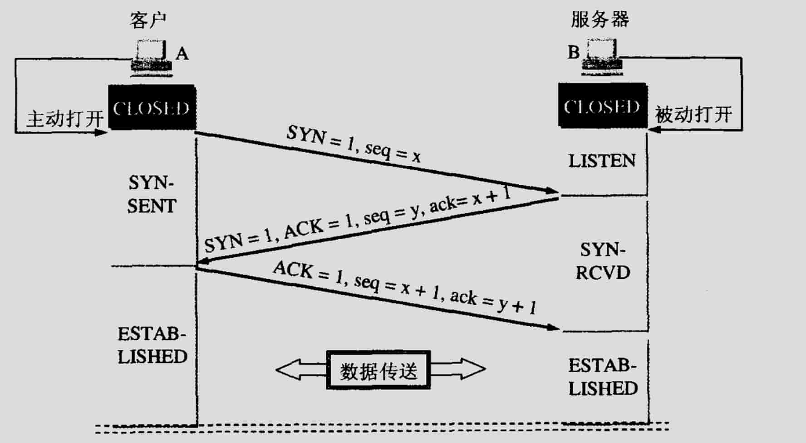
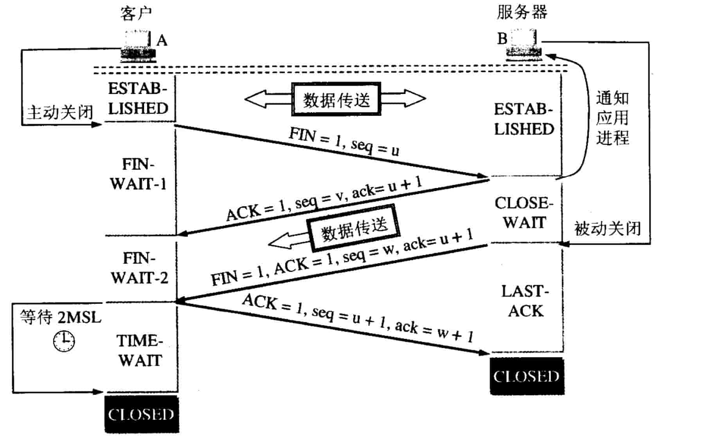

# Transmission Control Protocol


# 三次握手

## 三次握手



三次握手的主要目的是避免历史错误连接的建立并让通信的双方确定初始序列号

```
客户端–发送带有 SYN 标志的数据包–一次握手–服务端
服务端–发送带有 SYN/ACK 标志的数据包–二次握手–客户端
客户端–发送带有带有 ACK 标志的数据包–三次握手–服务端
```

握手的目标？

1.同步 Sequence 序列号    

• 初始序列号 ISN(Initial Sequence Number)

2.交换 TCP 通讯参数  
  
• 如 MSS、窗口比例因子、选择性确认、指定校验和算法

客户端为什么要发送最后一次的ACK？

防止异常情况：客户端"已经失效的连接请求报文"连到服务端，
即因为客户端发了两个连接请求（其中一个超时后来又被服务端收到了）

我的理解：通过三次握手双方都能确认对方能发送报文和收到报文

## 四次挥手




```
断开一个 TCP 连接则需要“四次挥手”：

1.客户端-发送一个 FIN，用来关闭客户端到服务器的数据传送
2.服务器-收到这个 FIN，它发回一个ACK，确认序号为收到的序号加1
3.服务器-关闭与客户端的连接，发送一个FIN给客户端
4.客户端-发回 ACK 报文确认，并将确认序号设置为收到序号加1
```

为什么要四次挥手?

任何一方都可以在数据传送结束后发出连接释放的通知，待对方确认后进入半关闭状态。
当另一方也没有数据再发送的时候，则发出连接释放通知，对方确认后就完全关闭了TCP连接。

为什么主动关闭的一方有TIME-WAIT状态？

1.保证最后一个ACK报文能够到达。如果这个ACK丢失，对方会重传FIN+ACK

2.下一个新的连接不会出现旧的连接请求报文；在TIME-WAIT时间内本连接内所有报文都消失

time_wait问题：    
net.ipv4.tcp_tw_reuse=1    
net.ipv4.tcp_tw_recycle=0    
net.ipv4.tcp_max_tw_bucket=0    

# 可靠传输

## 1.确认机制

## 2.超时重传

## 3.拥塞控制

有了TCP的窗口控制，能够连续发生大量数据包，可能会因为其他主机之间的通信导致网络拥堵，
在网络拥堵时，如果突然发送一个较大量的数据，极有可能会导致整个网络的瘫痪，
TCP为了防止这个现象的出现，在通信一开始就会通过一个叫做慢启动的算法得出的数值，对发送数据量进行控制。

### 慢开始、拥塞避免、快重传、快恢复

```
TCP的拥塞控制采用了四种算法，即 慢开始 、 拥塞避免 、快重传 和 快恢复。
在网络层也可以使路由器采用适当的分组丢弃策略（如主动队列管理 AQM），以减少网络拥塞的发生。
```

## 4.流量控制

滑动窗口

```
流量控制
```

# Socket 长连接的实现

背景知识
Socket 长连接，指的是在客户和服务端之间保持一个 socket 连接长时间不断开。
socket.setKeepAlive(true);


# UDP用户数据报协议

UDP 是无连接的。数据报（类似于数据包）只在数据报级别有保证。数据报可能会无序的到达目的地，也有可能会遗失。UDP 不支持拥塞控制。虽然不如 TCP 那样有保证，但 UDP 通常效率更高。

UDP 可以通过广播将数据报发送至子网内的所有设备。这对 DHCP 很有用，因为子网内的设备还没有分配 IP 地址，而 IP 对于 TCP 是必须的。

UDP 可靠性更低但适合用在网络电话、视频聊天，流媒体和实时多人游戏上。

以下情况使用 UDP 代替 TCP：

- 你需要低延迟
- 相对于数据丢失更糟的是数据延迟
- 你想实现自己的错误校正方法

# UDP 和 TCP 的区别？

TCP 是面向连接的协议
UDP 是无连接的协议

TCP 在发送数据前先需要建立连接，然后再发送数据
UDP 无需建立连接就可以直接发送大量数据

TCP 会按照特定顺序重新排列数据包
UDP 数据包没有固定顺序，所有数据包都相互独立

TCP 传输的速度比较慢
UDP 的传输会更快

TCP 的头部字节有 20 字节
UDP 的头部字节只需要 8 个字节

TCP 是重量级的，在发送任何用户数据之前，TCP需要三次握手建立连接。
UDP 是轻量级的。没有跟踪连接，消息排序等。

TCP 会进行错误校验，并能够进行错误恢复
UDP 也会错误检查，但会丢弃错误的数据包。

TCP 有发送确认
UDP 没有发送确认

TCP 会使用握手协议，例如 SYN，SYN-ACK，ACK
无握手协议

TCP 是可靠的，因为它可以确保将数据传送到路由器。
在 UDP 中不能保证将数据传送到目标。


1.解释TCP和UDP？
2。TCP特点？
3。TCP怎么做可靠传输的？
4。TCP三次握手？
5。TCP四次挥手？
6。TimeWait是啥？有什么影响？怎样解决？

# 如何判断远程机器上某个端口是否开启，项目中需要查看域名在本地的解析 IP ，如何操作。

telnet 10.0.250.3 80    
ssh ... -p    
wget ip:port    


GET/POST 区别。    

UDP/TCP区别。   
  
TCP 三次握手。以及衍生出来一些列的 TCP 的问题：什么是 TIME-WAIT、为什么可以是三次挥手、为什么不能是两次握手、流量控制、滑动窗口、Nagle 算法、糊涂窗口综合症、拥塞控制、慢启动、拥塞避免、快重传、快恢复、长连接 VS 短连接、应用场景是什么。    

什么时候用长连接，短连接？     
 　　长连接多用于操作频繁，点对点的通讯，而且连接数不能太多情况，。每个TCP连接都需要三步握手，这需要时间，如果每个操作都是先连接，再操作的话那么处理速度会降低很多，所以每个操作完后都不断开，次处理时直接发送数据包就OK了，不用建立TCP连接。例如：数据库的连接用长连接， 如果用短连接频繁的通信会造成socket错误，而且频繁的socket 创建也是对资源的浪费。 
  
　　而像WEB网站的http服务一般都用短链接，因为长连接对于服务端来说会耗费一定的资源，而像WEB网站这么频繁的成千上万甚至上亿客户端的连接用短连接会更省一些资源，如果用长连接，而且同时有成千上万的用户，如果每个用户都占用一个连接的话，那可想而知吧。所以并发量大，但每个用户无需频繁操作情况下需用短连好。

HTTP 1.0、1.1、2.0。    

说一下 HTTPS 的流程、SSL 是什么、什么是非对称加密、对称加密、RSA 具体实现。    

OSI 七层模型是什么、都有哪些协议、TCP/IP 四层是什么。    

DNS、ARP 协议原理。     

地址栏输入 URL 发生了什么。    

WebSocket 是什么。        

一些网络安全问题、比如 DOS 攻击如何解决、DNS 欺骗如何解决、ARP欺骗、SQL注入、XSS、CSRF、iframe 安全问题、本地存储数据问题、第三方依赖的安全性问题。    

HTTP 是不保存状态的协议、那么如何保存用户状态。    

# Cookie 的作用是什么、和 Session 有什么区别。    

web应用开发里就出现了保持http链接状态的技术：一个是cookie技术，另一种是session技术。

Cookie就是由服务器发给客户端的特殊信息，而这些信息以文本文件的方式存放在客户端，然后客户端每次向服务器发送请求的时候都会带上这些特殊的信息。

# Session 的实现机制是什么、分布式环境下有什么注意事项、如果注销 Session、设置 Session 的时长如何操作、默认时长是多少。    

session技术则是服务端的解决方案，它是通过服务器来保持状态的。
在服务器端程序运行的过程中创建的，不同语言实现的应用程序有不同创建Session的方法

cookie与session的关系:

cookie和session的方案虽然分别属于客户端和服务端，但是服务端的session的实现对客户端的cookie有依赖关系的，上面我讲到服务端执行session机制时候会生成session的id值，这个id值会发送给客户端，客户端每次请求都会把这个id值放到http请求的头部发送给服务端，而这个id值在客户端会保存下来，保存的容器就是cookie，因此当我们完全禁掉浏览器的cookie的时候，服务端的session也会不能正常使用

将session数据存储到内存是最佳的选择。因此最好的解决方案就是使用分布式缓存技术，例如：memcached和redis，将session信息的存储独立出来也是解决session同步问题的方法。


# HTTP 1.0 和 HTTP 1.1 的主要区别是什么。    

HTTP 1.1 使用了摘要算法来进行身份验证
HTTP 1.1 默认使用长连接，长连接就是只需一次建立就可以传输多次数据，传输完成后，只需要一次切断连接即可。长连接的连接时长可以通过请求头中的 keep-alive 来设置
HTTP 1.1 中新增加了 E-tag，If-Unmodified-Since, If-Match, If-None-Match 等缓存控制标头来控制缓存失效。
HTTP 1.1 支持断点续传，通过使用请求头中的 Range 来实现。
HTTP 1.1 使用了虚拟网络，在一台物理服务器上可以存在多个虚拟主机（Multi-homed Web Servers），并且它们共享一个IP地址。

- 长连接 : 在 HTTP/1.0 中，默认使用的是短连接，也就是每次请求都要重新建立一次连接。HTTP 是基于 TCP/IP 协议的，每一次建立或者断开连接，都需要三次握手四次挥手的开销，如果每次请求都要这样的话，开销会比较大，因此最好能维持一个长连接，可以用长连接来发多个请求。HTTP 1.1 起，默认使用长连接 Connection： keep-alive。 HTTP/1.1 的持续连接，有非流水线方式和流水线方式 。流水线方式，是客户在收到 HTTP 的响应报文之前，就能接着发送新的请求报文；与之相对应的非流水线方式，是客户在收到前一个响应后才能发起下一个请求；

- 错误响应码：在 HTTP 1.1 中，新增了 24 个错误状态响应码，如 409（Conflict）：表示请求的资源与资源的当前状态发生冲突；410（Gone）：表示服务器上的某个资源被永久性的删除；

- 缓存处理：HTTP 1.0 中，主要使用 header 头里的 If-Modified-Since、Expires 来做为缓存判断的标准；HTTP 1.1，则引入了更多的缓存控制策略，如 Entity tag，If-Unmodified-Since, If-Match, If-None-Match 等；

- 带宽优化及网络连接的使用：HTTP 1.0 中，存在一些浪费带宽的现象，例如客户端只是需要某个对象的一部分，而服务器却将整个对象传送了过来，并且不支持断点续传功能；HTTP 1.1 中，则在请求头引入了 range 头域，它允许只请求资源的某个部分，即返回码是 206（Partial Content），这样方便开发者自由的选择，以便于充分利用带宽和连接。


各种协议与 HTTP 协议之间的关系。    
Servlet、Filter 和 Listener 分别是什么，用在什么地方，JSP 页面如何进行处理。    
请求转发、URL 重定向和包含有什么区别，如何实现。    
如何判断远程机器上某个端口是否开启，项目中需要查看域名在本地的解析 IP ，如何操作。    
Servlet 中，调用 JSP 展示元素和返回 String（即 api，一般是 json 数据）有什么区别。    
nginx + tomcat 模式下，服务器段如何获取客户端请求 IP 。    
Servlet 的生命周期是什么。    
Servlet 是否是线程安全的。    