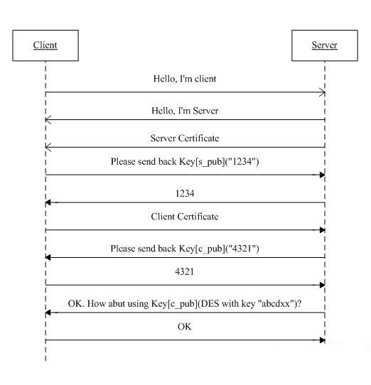
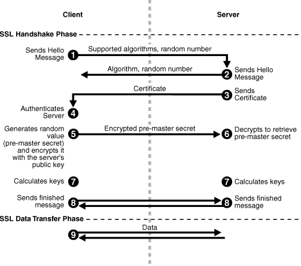
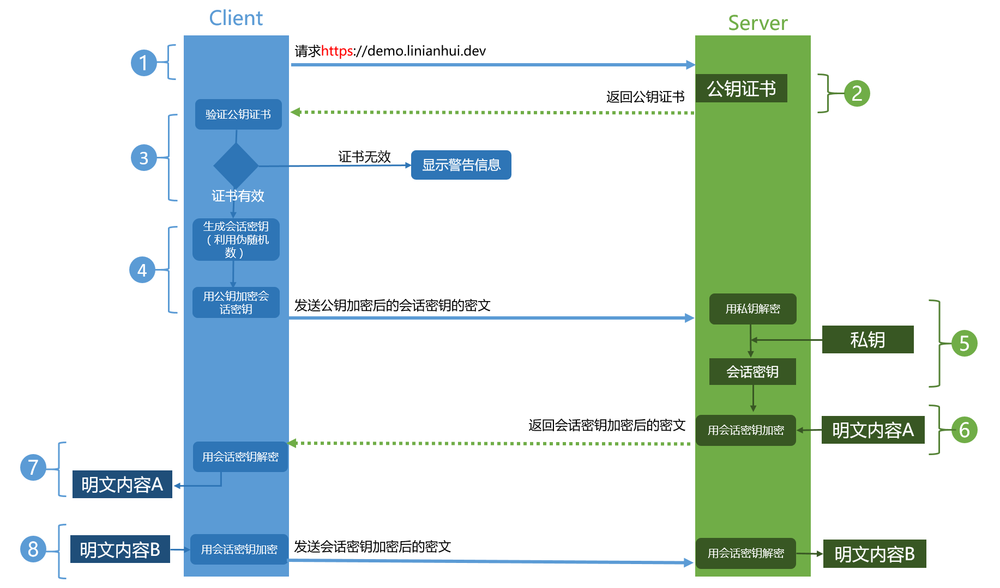

# 流程

HTTPS实际上就是HTTP+SSL的实现，建立的流程应该是这样：

①客户端的浏览器向服务器传送客户端 SSL 协议的版本号，加密算法的种类，产生的随机数，以及其他服务器和客户端之间通讯所需要的各种信息。

②服务器向客户端传送 SSL 协议的版本号，加密算法的种类，随机数以及其他相关信息，同时服务器还将向客户端传送自己的证书。

③客户利用服务器传过来的信息 验证服务器的合法性，服务器的合法性包括：证书是否过期，发行服务器证书的 CA 是否可靠，发行者证书的公钥能否正确解开服务器证书的“发行者的数字签名”，服务器证书上的域名是否和服务器的实际域名相匹配。如果合法性验证没有通过，通讯将断开；如果合法性验证通过，将继续进行第四步。

④用户端随机产生一个用于后面通讯的“对称密码”，然后 用服务器的公钥（服务器的公钥从步骤②中的服务器的证书中获得）对其加密，然后将加密后的“预主密码”传给服务器。

⑤如果服务器要求客户的身份认证（在握手过程中为可选），用户可以建立一个随机数然后对其进行数据签名，将这个含有签名的随机数和客户自己的证书以及加密过的“预主密码”一起传给服务器。

⑥如果服务器要求客户的身份认证，服务器必须检验客户证书和签名随机数的合法性，具体的合法性验证过程包括：客户的证书使用日期是否有效，为客户提供证书的CA 是否可靠，发行CA 的公钥能否正确解开客户证书的发行 CA 的数字签名，检查客户的证书是否在证书废止列表（CRL）中。检验如果没有通过，通讯立刻中断；

⑦如果验证通过，服务器将用自己的私钥解开加密的“预主密码”，然后执行一系列步骤来产生主通讯密码（客户端也将通过同样的方法产生相同的主通讯密码）。

⑧服务器和客户端用相同的主密码即“通话密码”，一个对称密钥用于 SSL 协议的安全数据通讯的加解密通讯。同时在 SSL 通讯过程中还要完成数据通讯的完整性，防止数据通讯中的任何变化。

⑨客户端向服务器端发出信息，指明后面的数据通讯将使用的步骤⑦中的主密码为对称密钥，同时通知服务器客户端的握手过程结束。

⑩服务器向客户端发出信息，指明后面的数据通讯将使用的步骤⑦中的主密码为对称密钥，同时通知客户端服务器端的握手过程结束。

SSL 的握手部分结束，SSL 安全通道的数据通讯开始，客户和服务器开始使用相同的对称密钥进行数据通讯，同时进行通讯完整性的检验。

从上面的流程可以看出（加粗字体），SSL通信在握手阶段使用的是非对称加密，在数据的传输阶段使用的是对成加密。

Client发起一个HTTPS（https:/demo.linianhui.dev）的请求，根据RFC2818的规定，Client知道需要连接Server的443（默认）端口。
Server把事先配置好的公钥证书（public key certificate）返回给客户端。
Client验证公钥证书：比如是否在有效期内，证书的用途是不是匹配Client请求的站点，是不是在CRL吊销列表里面，它的上一级证书是否有效，这是一个递归的过程，直到验证到根证书（操作系统内置的Root证书或者Client内置的Root证书）。如果验证通过则继续，不通过则显示警告信息。
Client使用伪随机数生成器生成加密所使用的会话密钥，然后用证书的公钥加密这个会话密钥，发给Server。
Server使用自己的私钥（private key）解密这个消息，得到会话密钥。至此，Client和Server双方都持有了相同的会话密钥。
Server使用会话密钥加密“明文内容A”，发送给Client。
Client使用会话密钥解密响应的密文，得到“明文内容A”。
Client再次发起HTTPS的请求，使用会话密钥加密请求的“明文内容B”，然后Server使用会话密钥解密密文，得到“明文内容B”。

# https优化

1. 硬件优化
2. 软件优化
3. 协议优化
4. 证书优化

# Status Code

## 1xx Informational

100 Continue

101 Switching Protocols

102 Processing (WebDAV)

## 2xx Success

 200 OK

 201 Created

 202 Accepted

 203 Non-Authoritative Information

 204 No Content

 205 Reset Content

 206 Partial Content

 207 Multi-Status (WebDAV)

 208 Already Reported (WebDAV)

 226 IM Used

# 3xx Redirection

300 Multiple Choices

301 Moved Permanently

302 Found

303 See Other

 304 Not Modified

305 Use Proxy

306 (Unused)

307 Temporary Redirect

308 Permanent Redirect (experimental)

## 4xx Client Error

 400 Bad Request

 401 Unauthorized

 402 Payment Required

 403 Forbidden

 404 Not Found

 405 Method Not Allowed

406 Not Acceptable

407 Proxy Authentication Required

408 Request Timeout

 409 Conflict

410 Gone

411 Length Required

412 Precondition Failed

413 Request Entity Too Large

414 Request-URI Too Long

415 Unsupported Media Type

416 Requested Range Not Satisfiable

417 Expectation Failed

418 I'm a teapot (RFC 2324)

420 Enhance Your Calm (Twitter)

422 Unprocessable Entity (WebDAV)

423 Locked (WebDAV)

424 Failed Dependency (WebDAV)

425 Reserved for WebDAV

426 Upgrade Required

428 Precondition Required

429 Too Many Requests

431 Request Header Fields Too Large

444 No Response (Nginx)

449 Retry With (Microsoft)

450 Blocked by Windows Parental Controls (Microsoft)

451 Unavailable For Legal Reasons

499 Client Closed Request (Nginx)

## 5xx Server Error

 500 Internal Server Error
 
501 Not Implemented

502 Bad Gateway

503 Service Unavailable

504 Gateway Timeout

505 HTTP Version Not Supported

506 Variant Also Negotiates (Experimental)

507 Insufficient Storage (WebDAV)

508 Loop Detected (WebDAV)

509 Bandwidth Limit Exceeded (Apache)

510 Not Extended

511 Network Authentication Required
