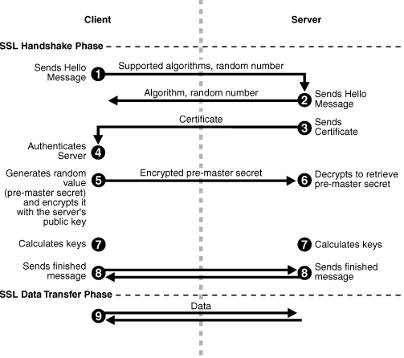

# 流程

HTTPS实际上就是HTTP+SSL的实现，建立的流程应该是这样：

①客户端的浏览器向服务器传送客户端 SSL 协议的版本号，加密算法的种类，产生的随机数，以及其他服务器和客户端之间通讯所需要的各种信息。

②服务器向客户端传送 SSL 协议的版本号，加密算法的种类，随机数以及其他相关信息，同时服务器还将向客户端传送自己的证书。

③客户利用服务器传过来的信息 验证服务器的合法性，服务器的合法性包括：证书是否过期，发行服务器证书的 CA 是否可靠，发行者证书的公钥能否正确解开服务器证书的“发行者的数字签名”，服务器证书上的域名是否和服务器的实际域名相匹配。如果合法性验证没有通过，通讯将断开；如果合法性验证通过，将继续进行第四步。

④用户端随机产生一个用于后面通讯的“对称密码”，然后 用服务器的公钥（服务器的公钥从步骤②中的服务器的证书中获得）对其加密，然后将加密后的“预主密码”传给服务器。

⑤如果服务器要求客户的身份认证（在握手过程中为可选），用户可以建立一个随机数然后对其进行数据签名，将这个含有签名的随机数和客户自己的证书以及加密过的“预主密码”一起传给服务器。

⑥如果服务器要求客户的身份认证，服务器必须检验客户证书和签名随机数的合法性，具体的合法性验证过程包括：客户的证书使用日期是否有效，为客户提供证书的CA 是否可靠，发行CA 的公钥能否正确解开客户证书的发行 CA 的数字签名，检查客户的证书是否在证书废止列表（CRL）中。检验如果没有通过，通讯立刻中断；

⑦如果验证通过，服务器将用自己的私钥解开加密的“预主密码”，然后执行一系列步骤来产生主通讯密码（客户端也将通过同样的方法产生相同的主通讯密码）。

⑧服务器和客户端用相同的主密码即“通话密码”，一个对称密钥用于 SSL 协议的安全数据通讯的加解密通讯。同时在 SSL 通讯过程中还要完成数据通讯的完整性，防止数据通讯中的任何变化。

⑨客户端向服务器端发出信息，指明后面的数据通讯将使用的步骤⑦中的主密码为对称密钥，同时通知服务器客户端的握手过程结束。

⑩服务器向客户端发出信息，指明后面的数据通讯将使用的步骤⑦中的主密码为对称密钥，同时通知客户端服务器端的握手过程结束。

SSL 的握手部分结束，SSL 安全通道的数据通讯开始，客户和服务器开始使用相同的对称密钥进行数据通讯，同时进行通讯完整性的检验。

从上面的流程可以看出（加粗字体），SSL通信在握手阶段使用的是非对称加密，在数据的传输阶段使用的是对成加密。

# https优化

1. 硬件优化
2. 软件优化
3. 协议优化
4. 证书优化
